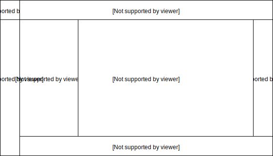

Kytos UI
====================

Kytos Graphical User Interface

Overview
---------

A Vue.js project that implements the Kytos graphical user interface.

.. figure:: ./src/assets/imgs/development/kytos-ui.png
   :scale: 50 %
   :alt: Kytos Graphical User Interface
   :align: center

   Kytos Graphical User Interface

Kytos UI Parts
------------------

**Image caption / Kytos UI Parts:**

#. **kytos-menu-bar**: A button with the kytos logo, which allows to switch between the extended or non-extended version of the kytos UI;

   #. Non-extended version of the menu bar;
   #. Extended version of the menu bar;
   #. Contents of the selected item in the extended version of the menu bar;

#. **kytos-map**: Map representation;
#. **kytos-info-panel**: Shows specific information of the selected component;
#. **kytos-tabs**: Tab with the terminal, switches, notifications and logging.

.. note:: It is allowed to add components only in the parts 1.x, 3 and 4.

List of Kytos UI Components
----------------------------

The following list shows the Kytos UI Components organized by categories:

Inputs
^^^^^^^

* Button

   **Name**: kytos-button

   **About**: Triggers an event when clicked.

 .. figure:: ./src/assets/imgs/development/components/input/kytos-button.png
   :scale: 50 %
   :alt: Button image.
   :align: center

   **Properties**: None.

   **Methods**: None.

.. Example:

* ButtonGroup

   **Name**: kytos-button-group

   **About**: Allows to group buttons, which trigger events when clicked.

.. figure:: ./src/assets/imgs/development/components/input/kytos-button-group.png
   :scale: 50 %
   :alt:  ButtonGroup image.
   :align: center

   **Properties**: None.

   **Methods**: None.

.. Example:

* Checkbox

   **Name**: kytos-checkbox

   **About**: A GUI widget that permits the user to make a binary choice, checked (ticked) when activated or not checked when disable.

.. .. figure:: ./src/assets/imgs/development/components/input/kytos-checkbox.png
   :scale: 50 %
   :alt: Checkbox image.
   :align: center
..

   **Properties**:

      * placeholder: String.

   **Methods**: None.

.. Example:

* Dropdown

   **Name**: kytos-dropdown

   **About**: A toggleable menu that allows the user to choose one value from a predefined list.

 .. figure:: ./src/assets/imgs/development/components/input/kytos-dropdown.png
   :scale: 50 %
   :alt: Dropdown image.
   :align: center

   **Properties**:

      * options: Array (required);
      * event: Object (required).

   **Methods**:

      * emitEvent();

.. Example:

* Input

   **Name**: kytos-input

   **About**: An input field where the user can enter data.

 .. figure:: ./src/assets/imgs/development/components/input/kytos-input.png
   :scale: 50 %
   :alt: Input image.
   :align: center

   **Properties**:

      * value: String;
      * modelValue: String;
      * tooltip: String;
      * placeholder: String.

   **Methods**:

      * updateText(value).

.. Example:

* Slider

   **Name**: kytos-slider

   **About**: A GUI widget that allows the users specify a numeric value which must be no less than a given value, and no more than another given value.

 .. figure:: ./src/assets/imgs/development/components/input/kytos-slider.png
   :scale: 50 %
   :alt: Slider image.
   :align: center

   **Properties**:

      * initialValue: Number;
      * action: Function(val):val;
      * min: Number;
      * max: Number;
      * step: Number.

   **Methods**:

      * doRange().

.. Example:

* Textarea

   **Name**: kytos-textarea

   **About**: A text input field with multi-line.

.. .. figure:: ./src/assets/imgs/development/textarea.png
   :scale: 50 %
   :alt: Textarea image.
   :align: center
..

   **Properties**:

      * value: String;
      * modelValue: String;
      * tooltip: String;
      * placeholder: String.

   **Methods**:

      * updateText(value).

.. Example:

Accordion
^^^^^^^^^^

* Accordion

   **Name**: kytos-accordion

   **About**: A GUI widget with a list of items that can be switched between hiding and showing content.

 .. figure:: ./src/assets/imgs/development/accordion/kytos-accordion.png
   :scale: 50 %
   :alt: Accordion image.
   :align: center

   **Properties**: None.

   **Methods**: None.

.. Example:

* AccordionItem

   **Name**: kytos-accordion-item

   **About**: Accordion item that can be switched between hiding and showing content.

 .. figure:: ./src/assets/imgs/development/accordion/kytos-accordion-item.png
   :scale: 50 %
   :alt: AccordionItem image.
   :align: center

   **Properties**: None.

   **Methods**: None.

.. Example:

Misc
^^^^^

* ActionMenu

   **Name**: kytos-action-menu

   **About**: Menu with a list of actions. Can be shown or hidden using the *Ctrl+Space* shortcut.

 .. figure:: ./src/assets/imgs/development/misc/kytos-action-menu.png
   :scale: 50 %
   :alt: ActionMenu image.
   :align: center

   **Properties**: None.

   **Methods**:

      * toggle();
      * hide();
      * show_info_panel(content).

.. Example:

* InfoPanel

   **Name**: kytos-info-panel

   **About**: Shows details about selected kytos components. The panel can be shown or hidden using the shortcut *Ctrl+Alt+Space*.

 .. figure:: ./src/assets/imgs/development/development/misc/kytos-info-panel.png
   :scale: 50 %
   :alt: infopanel image.
   :align: center

   **Properties**:

      * subtitle: String.

   **Methods**:

      * toggle();
      * hide();
      * show(content);
      * register_listeners().

.. Example:

* StatusBar

   **Name**: kytos-status-bar

   **About**: A tabbed bar such as a Terminal, Switches, Logging, Notifications and System Information.

 .. figure:: ./src/assets/imgs/development/development/misc/kytos-status-bar.png
   :scale: 50 %
   :alt: StatusBar image.
   :align: center

   **Properties**: None.

   **Methods**:

      * display_messages();
      * get_terminal();
      * set_status(message, error=false);
      * register_listeners().

.. Example:

Property Panel
^^^^^^^^^^^^^^^

* PropertyPanel

   **Name**: kytos-property-panel

   **About**: Component with a list of items that are properties of the Request E-Line Circuit.

.. .. figure:: ./src/assets/imgs/development/property-panel.png
   :scale: 50 %
   :alt: PropertyPanel image.
   :align: center
..

   **Properties**: None.

   **Methods**: None.

.. Example:

* PropertyPanelItem

   **Name**: kytos-property-panel-item

   **About**: Property Panel item that can be edited.

.. .. figure:: ./src/assets/imgs/development/property-panel-item.png
   :scale: 50 %
   :alt: PropertyPanelItem image.
   :align: center
..

   **Properties**:

      * name: String (required);
      * value: [String, Number] (required).

   **Methods**: None.

.. Example:

Switch
^^^^^^^

* Flow

   **Name**: kytos-flow

   **About**: Representation of flows between interfaces.

.. .. figure:: ./src/assets/imgs/development/flow.png
   :scale: 50 %
   :alt: Flow image.
   :align: center
..

   **Properties**:

      * content: Object (required).

   **Methods**:

      * get_plot_selector();
      * update_chart().

.. Example:

* Interface

   **Name**: kytos-interface

   **About**: Representation of the interfaces (hardware) used.

.. .. figure:: ./src/assets/imgs/development/interface.png
      :scale: 50 %
      :alt: Interface image.
      :align: center
..

   **Properties**:

         * name: String (required);
         * mac: String (required);
         * speed: Number;
         * port_number: Number (required);
         * interface_id: String (required).

   **Methods**:

      * open_interface();
      * parseInterfaceData (data);
      * update_chart();

.. Example:

.. ### Tabs
.. * `tabs`:

 ### Base *
 * `KytosBase`:
 * `KytosBaseWithIcon`:

 ### Chart *
 * `RadarChart`:
 * `Timeseries`:

 ### Logging *
 * `Logging-Utils`:
 * `Logging`:

 ### Map *
 * `Map`:

 ### Terminal *
 * `Terminal`:

    ### Topology *
    * `ContextPanel`:
    * `Menubar`:
    * `Toolbar`
