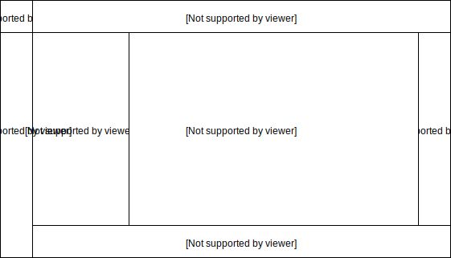

Kytos UI
====================

Kytos Graphical User Interface

Overview
---------

A Vue.js project that implements the Kytos graphical user interface.

.. figure:: ./src/assets/imgs/kytos-ui.png
   :scale: 50 %
   :alt: Kytos Graphical User Interface
   :align: center
   
   Kytos Graphical User Interface

Kytos UI Parts
------------------

**Image caption / Kytos UI Parts:**

#. `logo / logo expanded`: A button with the kytos logo, which allows to switch between the extended or non-extended version of the kytos UI;
#. `kytos-toolbar`: Non-extended version of the menu bar;
#. `kytos-menu-bar`: Extended version of the menu bar;
#. `kytos-context-panel`: Contents of the selected item in the *kytos-menu-bar*;
#. `kytos-map`: Map representation;
#. `kytos-info-panel`: Shows specific information of the selected component;
#. `kytos-tabs`: Tab with the terminal, switches, notifications and logging.

List of Kytos UI Components
----------------------------

The following list shows the Kytos UI Components organized by categories:

Inputs
^^^^^^^

* Buttons
    * `Button`:
    * `ButtonGroup`:
* `Checkbox`:
* `Dropdown`:
* `Input`:
* `Slider`:
* `Textarea`:

Accordion
^^^^^^^^^^

* `Accordion`:
* `AccordionItem`:

Misc
^^^^^

* `ActionMenu`:
* `InfoPanel`:
* `StatusBar`:

Property Panel
^^^^^^^^^^^^^^^

* `PropertyPanel`:
* `PropertyPanelItem`:

Switch
^^^^^^^

* `Flow`:
* `Interface`:

.. ### Tabs
.. * `tabs`:

 ### Base *
 * `KytosBase`:
 * `KytosBaseWithIcon`:

 ### Chart *
 * `RadarChart`:
 * `Timeseries`:

 ### Logging *
 * `Logging-Utils`:
 * `Logging`:

 ### Map *
 * `Map`:

 ### Terminal *
 * `Terminal`:

    ### Topology *
    * `ContextPanel`:
    * `Menubar`:
    * `Toolbar`
